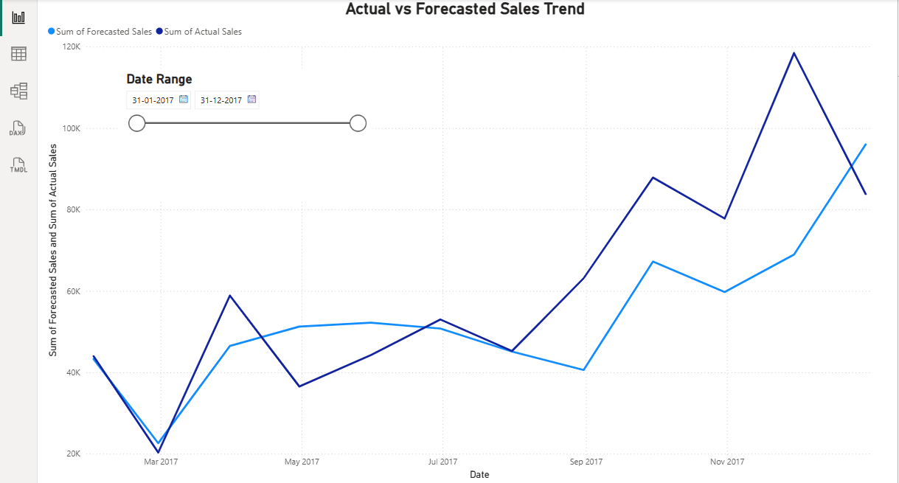
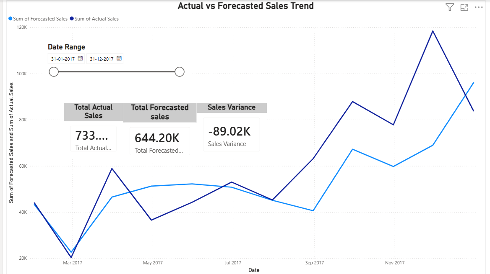

# FUTURE_ML_01 – Sales Forecasting Dashboard

## Overview
This project focuses on analyzing historical sales data and forecasting future sales trends using Power BI.  
The goal is to help stakeholders understand sales performance, identify trends, and make data-driven decisions using interactive dashboards.

The dashboard compares **actual sales vs forecasted sales** over time and provides high-level KPIs for performance monitoring.

---

## Tools & Technologies
- Power BI
- DAX (Data Analysis Expressions)
- Excel / CSV Dataset
- Data Modeling & Visualization

---

## Key Features
- Interactive sales trend analysis
- Actual vs Forecasted sales comparison
- Sales forecasting using historical data
- KPI cards for quick performance insights
- Date-based filtering using slicers

---

## Dashboard Preview
> Screenshots of the dashboard are provided below.

---

## Project Structure

FUTURE_ML_01/

dashboard/
sales_forecasting_dashboard.pbix

images/
dashboard_overview.png
sales_forecast.png
kpi_analysis.png

data/
raw/
processed/

README.md
.gitignore

---

## KPIs Used
- Total Actual Sales
- Total Forecasted Sales
- Sales Variance (Forecast − Actual)

---

## Learnings
- Building analytical data models in Power BI
- Writing DAX measures for business KPIs
- Designing clean and user-focused dashboards
- Converting raw data into actionable insights

---

## Author
Rizwan Ali Razvi  
B.Tech CSE | Power BI & Data Analytics
